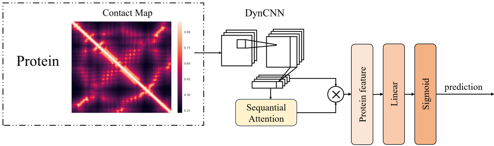

# Designing Rational PROTAC Linkers through Deep Learning

## Abstract
In recent years, protein degrader-based drugs, known as Proteolysis Targeting Chimeras (PROTACs), have gained considerable attention as a novel therapeutic strategy. The utilization of deep learning techniques in designing PROTACs has emerged as a prominent research focus. The powerful capabilities of deep learning enable researchers to more accurately predict molecular structures and activities, thereby facilitating the design of PROTACs with enhanced efficacy and selectivity. The focus of this study is to utilize deep learning to investigate the potential relationship between the molecular connectors of PROTACs and the protein targets they act upon.
The deep neural network model employed in this study is a convolutional neural network (CNN) with a sequence attention mechanism. Protein sequences are transformed into protein contact maps, which serve as inputs to the model, while the functional groups contained in PROTAC connectors are utilized as labels for learning. Due to the limited size of existing datasets and the imbalance between positive and negative samples, data augmentation and oversampling techniques were employed. Protein sequences were randomly cropped into subchains of varying lengths, with equal numbers of subchains produced for both positive and negative classes, effectively addressing the issues of data scarcity and class imbalance-induced underfitting. Through a series of parameter adjustments to the CNN with attention mechanism, we achieved a maximum accuracy of 95.4% and an AUC of 99.5%, demonstrating the potential and effectiveness of deep learning in PROTACs design. Furthermore, a series of ablation experiments validated the superiority of the data preprocessing methods and model design employed in this study.
These research findings will provide important insights and guidance for future studies in drug design, exploration of binding sites and interaction patterns based on attention mechanisms, and investigation into the pharmacokinetic effects of PROTAC connectors on protein binding dynamics and their impact on therapeutic outcomes

## Dataset
Run the [data_achieve.py](.\data\contactmap\data_achieve.py) in connected mode, to obtain all protein contactmaps.

## Usage
To run the training procedure,

1. Install [requirements.txt](.\requirements.txt) to set up the envirnoment.
2. Run the [main.py](.\main.py) to train and test the model.